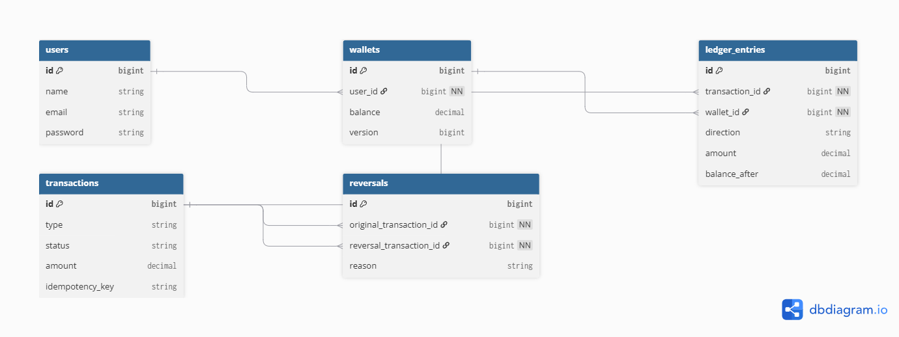
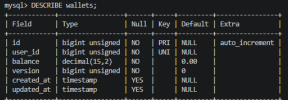
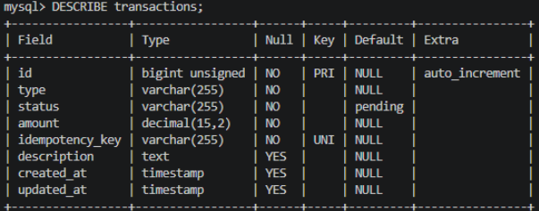
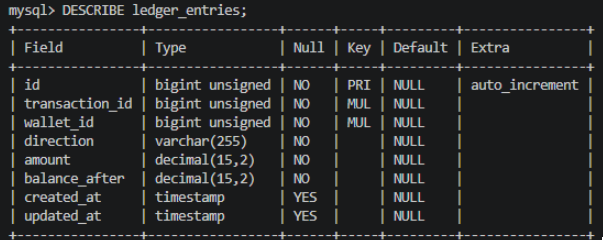
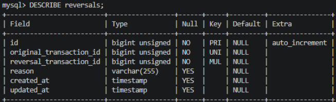

# Carteira Financeira
Desafio técnico Full Stack PHP: uma carteira digital com cadastro, autenticação, depósito, transferência entre usuários e reversão de operações, construída em Laravel seguindo o padrão de dupla entrada (double-entry ledger) usado por sistemas financeiros reais.


## Stack e Tecnologias
| Tecnologias | Motivo      |
| :---:   | :---:  |
| PHP 8.4 / Laravel 13 | Escolhi o Laravel por ser um framework consolidado e por já oferecer diversos recursos importantes. Isso me permitiu focar mais na implementação das regras de negócio do que na criação de funcionalidades básicas. Também utilizei os Enums do PHP para evitar o uso de strings fixas no código, deixando a aplicação mais organizada e fácil de manter.   |
| MySQL | O MySQL foi escolhido por fornecer recursos importantes para manter a consistência dos dados e garantir maior confiabilidade nas operações realizadas pelo sistema.|
| Laravel Sanctum | Utilizei o Laravel Sanctum para a autenticação da API por ser uma solução oficial do framework, simples de configurar e suficiente para o projeto. |
| Docker / Laravel Sai | Escolhi utilizar Docker com Laravel Sail para garantir que o ambiente de desenvolvimento fosse o mesmo em qualquer máquina. |
| Bootstrap 5 | Usei Bootstrap 5 para desenvolver a interface de forma mais rápida. Como o principal objetivo do teste é o backend não vi necessidade de me aprofundar mais nesse aspecto |


## Double Entry-Ledger

Este é o mesmo modelo contábil usado por bancos e por processadores de pagamento:
 
> **O saldo nunca é escrito diretamente por uma regra de negócio. Ele é sempre a consequência de uma sequência imutável de lançamentos.**
 
Cada operação financeira gera um ou mais registros em `ledger_entries`, cada um com:
- `direction` — `credit` (entrada) ou `debit` (saída)
- `amount` — o valor movimentado
- `balance_after` — um snapshot do saldo resultante, logo após aquele lançamento
Um **depósito** gera um lançamento (`credit`) na carteira do próprio usuário. Uma **transferência** gera **dois** lançamentos amarrados à mesma `transaction`: um `debit` na carteira de origem e um `credit` na carteira de destino.

## Modelagem de Dados

<div align="center">

### Diagrama



<sub>Diagrama gerado refletindo as tabelas implementadas do projeto.</sub>

---

### Wallets



<sub>Responsável por armazenar o saldo de cada usuário e realizar o controle de concorrência por meio do campo <code>version</code>.</sub>

---

### Transactions



<sub>Armazena todas as transações financeiras, incluindo depósitos, transferências e reversões.</sub>

---

### Ledger Entries



<sub>Registra os lançamentos contábeis (débito e crédito) associados a cada transação.</sub>

---

### Reversals



<sub>Armazena o vínculo entre uma transação original e sua respectiva reversão, evitando duplicidades.</sub>

</div>

## Arquitetura

```
app/
├── Services/           # Regra de negócio isolada
│   ├── DepositService.php
│   ├── TransferService.php
│   ├── ReversalService.php
│   └── RegistrationService.php
├── Models/             # Eloquent + relacionamentos
├── Enums/              # TransactionType, TransactionStatus, LedgerDirection
├── Http/
│   ├── Controllers/
│   │   ├── Web/        # Views Blade
│   │   └── Api/        # JSON via Sanctum
│   ├── Requests/        # Form Requests: validação compartilhada entre Web e API
│   └── Resources/       # Transformação de Models para o formato JSON da API
└── Exceptions/          # Exceptions de domínio com render() próprio
```

## Segurança

- **Hash de senha automático** via cast do Model (`'password' => 'hashed'`), usando bcrypt
- **Proteção contra mass assignment** — `$fillable` explícito em todos os Models
- **CSRF** em todos os formulários web (`@csrf`)
- **Proteção contra IDOR** (Insecure Direct Object Reference) — antes de reverter qualquer transação, o sistema verifica que ela de fato envolve a carteira do usuário autenticado, tanto no Controller Web quanto no da API
- **Prevenção de user enumeration** — o endpoint de login retorna a mesma mensagem genérica ("Credenciais inválidas") tanto para e-mail inexistente quanto para senha incorreta, para não revelar quais e-mails estão cadastrados
- **Rate limiting** (`throttle:5,1`) nas rotas de login e registro, limitando a 5 tentativas por minuto por IP — mitigação direta contra força bruta
- **Idempotência** via `idempotency_key` único, evitando que requisições duplicadas (clique duplo, retry de rede) processem a mesma operação mais de uma vez
- **Consciência de configuração de ambiente** — `APP_DEBUG` deve ser `false` em produção; em desenvolvimento fica `true` para facilitar depuração, mas a diferença é documentada explicitamente neste README

## Tratamento de erros

Exceptions de domínio (`app/Exceptions/`) encapsulam regras de negócio que podem falhar:
 
```php
public function render(Request $request): JsonResponse|RedirectResponse
{
    if ($request->expectsJson()) {
        return response()->json(['message' => $this->getMessage()], 422);
    }
 
    return back()->with('error', $this->getMessage());
}
```

## Testes


## Como rodar o projeto
 
O único pré-requisito é ter o **Docker** instalado e em execução. Não é necessário ter PHP, Composer ou qualquer outra ferramenta na máquina — tudo roda dentro de containers.
 
### Passo 1 — Clonar o repositório
 
```bash
git clone https://github.com/Joao-Mvll/Carteira-financeira.git
cd carteira-financeira
```
 
### Passo 2 — Instalar as dependências do PHP

Em vez de exigir Composer instalado na sua máquina, usamos um container temporário que já vem com tudo pronto, roda a instalação, e desaparece em seguida — sem deixar nada instalado permanentemente no seu sistema.
 
**Windows (PowerShell):**
```powershell
docker run --rm -v "${PWD}:/var/www/html" -w /var/www/html laravelsail/php84-composer:latest composer install --ignore-platform-reqs
```

## Passo 3 — Criar o arquivo de ambiente (`.env`)
 
**Windows (PowerShell):**
```powershell
copy .env.example .env
```

### Passo 4 — Subir os containers
 
```bash
docker compose up -d
```
 
Na primeira execução, o Docker vai baixar a imagem do MySQL e construir a imagem da aplicação — pode levar alguns minutos.
 
### Passo 5 — Preparar a aplicação
 
```bash
docker compose exec laravel.test php artisan key:generate
docker compose exec laravel.test php artisan migrate
```
 
### Passo 6 — Acessar
 
Abra **http://localhost** no navegador. A tela de login deve aparecer.
 

## Oque Foi Implementado

- Cadastro e autenticação (Web e API)
- Depósito, com abatimento correto de saldo negativo
- Transferência entre usuários, com validação de saldo
- Reversão de depósito e transferência, idempotente
- Extrato paginado e pesquisável
- API REST completa com Sanctum
- Interface web funcional (dashboard, depósito, transferência, extrato)